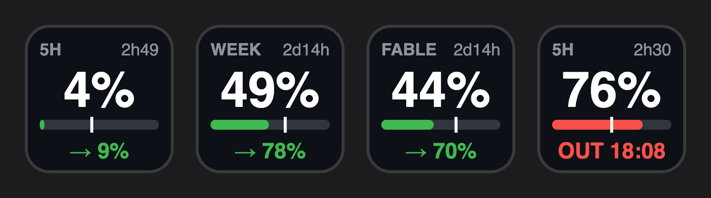

# Claude Usage

Your Claude plan limits on Stream Deck, with a forecast of where each one lands.



## Keys

Add the **Usage Limit** action and pick a limit in its settings:

- **5-hour session**
- **Weekly (all models)**
- **Weekly (Fable)**

Each key shows:

- **Top:** the limit's name and the time until it resets.
- **Middle:** the percent used.
- **Bar:** usage so far. The white tick marks where an even pace would put you now. Left of the tick means you are ahead of budget.
- **Bottom:** the forecast.
  - `→ 78%` is where you land at reset at your average rate so far. It is green below 80% and amber from 80% to 99%.
  - `OUT 18:08` (red) is when you hit 100% before the reset.
  - `…` appears during the first 10% of a window, when there is too little data to forecast.

Press a key to refresh right away.

## How it works

- **Data:** Claude Code stores its OAuth login in the macOS Keychain (`Claude Code-credentials`). The plugin reads that token and calls the same usage endpoint Claude Code's `/usage` command uses. When the token has expired and the `claude` CLI is not running, the plugin refreshes it the same way Claude Code does and writes the new pair back to the Keychain, so Claude Code keeps working too. Nothing leaves your Mac except those requests to `api.anthropic.com` and `platform.claude.com`.
- **When it polls:** Once a minute, and only while the Claude desktop app or the `claude` CLI is running. When neither is running, the keys dim and no requests are made.
- **Keychain prompt:** The first time it runs, macOS asks whether `node` may use the Keychain item. Choose **Always Allow**.

### Key states

| Key shows | Meaning |
| --- | --- |
| `RUN claude` | No valid login found, or the refresh failed. Open Claude Code to sign in. |
| `OFFLINE` | The request failed and there are no earlier numbers to show. |
| `N/A` | Your plan does not have this limit. |
| Dimmed | Claude is not running. The numbers are from the last poll. |

### Limitations

- The usage endpoint is undocumented, so Anthropic can change it without notice.
- The plugin is macOS only. On Windows, Claude Code keeps the token in `~/.claude/.credentials.json`, which is not supported yet.

## Development

```bash
npm install
npm run build
npx streamdeck link com.zgrgrcn.claude-usage.sdPlugin
npm test          # pace forecast checks
npm run watch     # rebuild and restart on change
```
