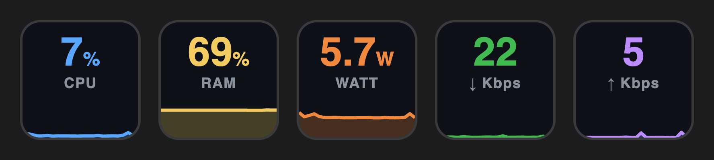

# System Monitor

Live system metrics on Stream Deck, each with a one-minute graph.



## Keys

Add the **System Metric** action and pick a metric in its settings:

| Metric | Source | Graph scale |
| --- | --- | --- |
| **CPU** | `os.cpus()` busy time across all cores | 0–100% |
| **RAM** | `vm_stat`: active + wired + compressed, as Activity Monitor counts "Memory Used" | 0–100% |
| **Power (W)** | SMC key `PSTR`, the whole Mac's power draw | Peak of the last minute, at least 10 W |
| **Network download / upload** | `netstat -ib` byte counters on `en*` interfaces, in bits per second | Peak of the last minute, at least 1 Mbps |

Samples are taken every 2 seconds, and only while at least one key is on screen. When you leave the folder or page, sampling stops and the graph starts fresh next time.

## Notes

- **Power:** Read by a small native helper, `native/smc-power.c`. It is built into `bin/smc-power` as a universal binary and needs no root. On Macs without the `PSTR` key (some Intel models), the key shows `—`.
- **Network:** VPN tunnels and bridges are left out, because their traffic also crosses an `en*` interface and would be counted twice.

## Development

```bash
npm install
npm run build     # builds the native helper and the plugin
npx streamdeck link com.zgrgrcn.system-monitor.sdPlugin
npm test          # parser and unit checks
npm run watch     # rebuild and restart on change (run build once first for the helper)
```
